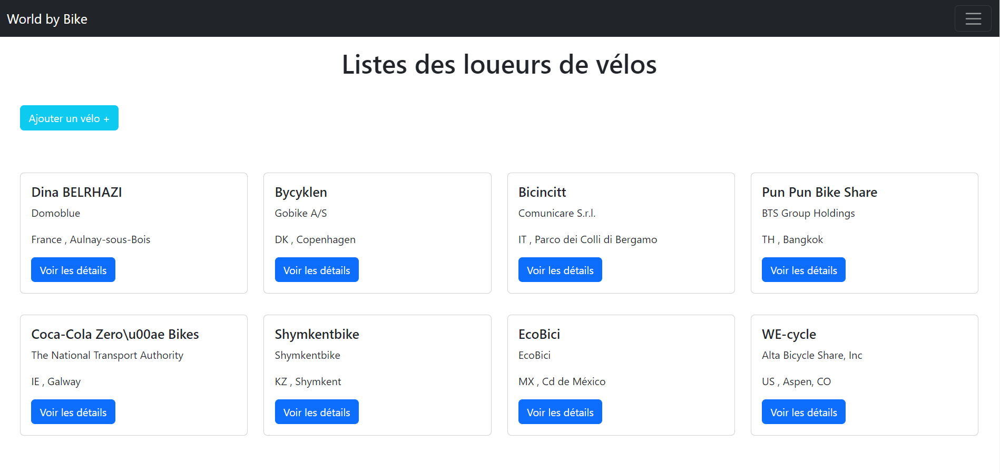
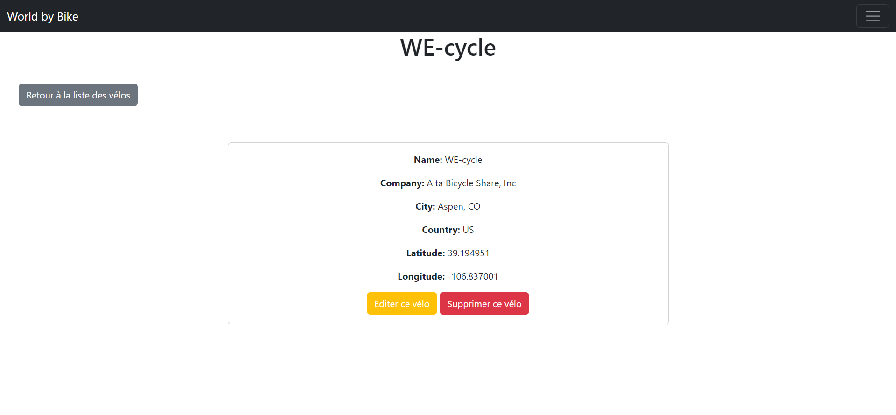
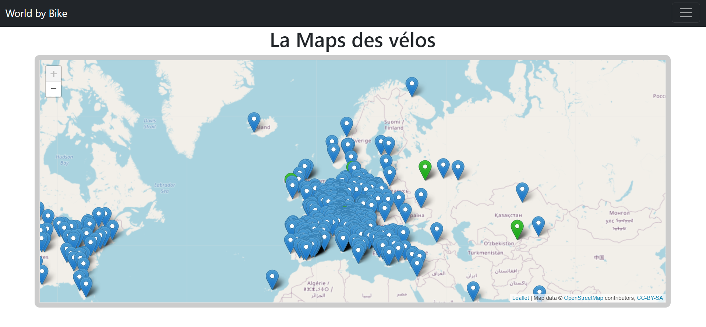

# World by Bike

World by Bike est une application réalisée avec Ruby on Rails.

Elle est composée de deux partie :
* Leaflet 
* CRUD

##Gestion des loueurs (CRUD)

Cette application est connectée à une base de donnée MySQL (velos.csv).

Cette partie permet la gestion des loueurs de vélos.

Il est possible d'afficher, modifier, supprimer les informations des loueurs.

##Maps

Cette cartographie ressence les loueurs de vélos enregistrés dans une api (https://api.citybik.es/v2/networks)
et dans la base de données (velos.csv)

